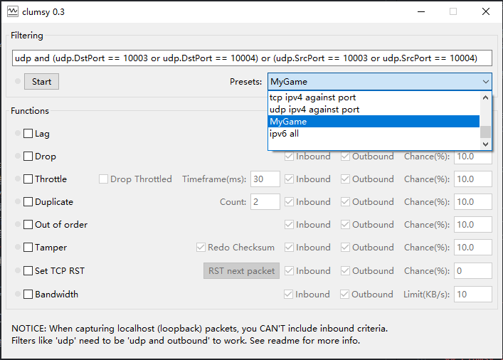
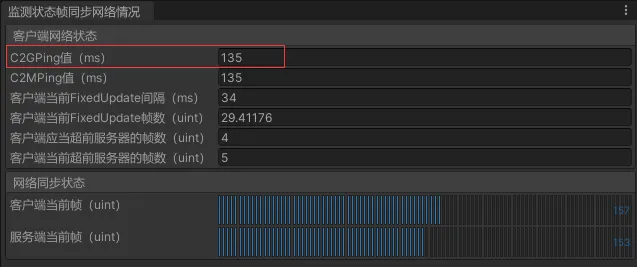

# Clumsy 配置说明

## 自定义配置示例

在 `config.txt` 中可以使用以下格式添加自定义配置，例如，以下配置是为起始和目标端口为10003和10004的UDP连接设置的：

\```plaintext
MyGame: udp and (udp.DstPort == 10003 or udp.DstPort == 10004) or (udp.SrcPort == 10003 or udp.SrcPort == 10004)
\```




## 配置好Functions下面的模块，然后点击Start，就可以看到效果了

[
Unity检测网络状况工具，C2GPing值就是10003或10004的端口Ping值。

## Clumsy 功能说明

- **延迟 (Lag)**：将数据包缓存一段时间后再发送，模拟网络延迟。
- **掉包 (Drop)**：随机丢弃一些数据包。
- **节流 (Throttle)**：拦截一小段时间内的数据包，然后在之后的一段时间内一同发送。
- **重发 (Duplicate)**：随机复制一些数据包并一同发送。
- **乱序 (Out of order)**：打乱数据包发送的顺序。
- **篡改 (Tamper)**：随机修改部分数据包内容。
- **TCP RST 攻击模拟 (Set TCP RST)**：模拟TCP RST攻击。
- **带宽限制 (BandWidth)**：通过限制带宽来模拟不同带宽下的网络表现。

仓库地址：https://github.com/jagt/clumsy 可以直接从Release列表下载

官方使用说明：http://jagt.github.io/clumsy/cn/index.html

详细的WinDivert配置文档可以参考 [WinDivert官方文档](https://reqrypt.org/windivert-doc.html#filter_language)。
